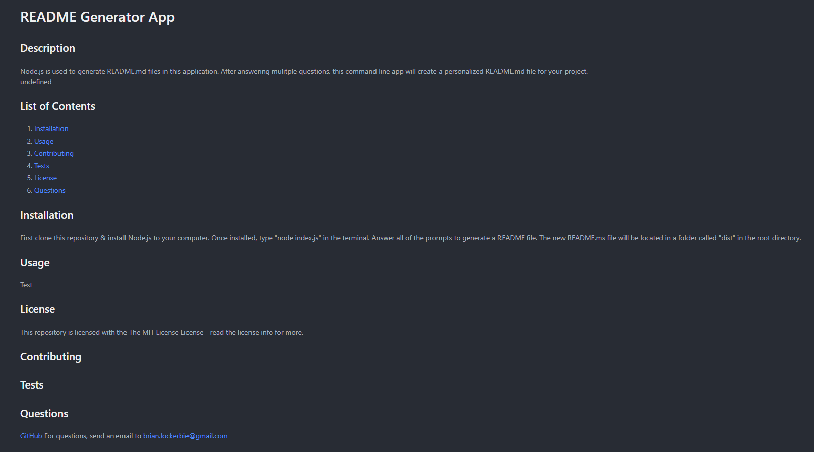

<h1 align="center">README Generator App 🔋</h1>

Module #9 - Node.js - Professional README Generator App

## Description
Node.js is used to generate README.md files in this application. After answering mulitple questions, this command line app will create a personalized README.md file for your project.

## Built With:
* JavaScript
* Node.js
* NPM
* Inquirer

## Installation
First clone this repository & install Node.js to your computer. Once installed, type "node index.js" in the terminal. Answer all of the prompts to generate a README file. The new README.ms file will be located in a folder called "dist" in the root directory.

## Usage
View video walkthrough on how to use this application: https://drive.google.com/file/d/1guk75kYYg_O4WBfT-7x07QlJWOnnQ5Ad/view

## Contributing

## Tests

## Questions

[GitHub](https://github.com/brianlockerbie)
For any questions, please send an Email to [brian.lockerebie@gmail.com](mailto:brian.lockerebie@gmail.com)

## User Story:
AS A developer
I WANT a README generator
SO THAT I can quickly create a professional README for a new project

## Acceptance Criteria:
GIVEN a command-line application that accepts user input
WHEN I am prompted for information about my application repository
THEN a high-quality, professional README.md is generated with the title of my project and sections entitled Description, Table of Contents, Installation, Usage, License, Contributing, Tests, and Questions
WHEN I enter my project title
THEN this is displayed as the title of the README
WHEN I enter a description, installation instructions, usage information, contribution guidelines, and test instructions
THEN this information is added to the sections of the README entitled Description, Installation, Usage, Contributing, and Tests
WHEN I choose a license for my application from a list of options
THEN a badge for that license is added near the top of the README and a notice is added to the section of the README entitled License that explains which license the application is covered under
WHEN I enter my GitHub username
THEN this is added to the section of the README entitled Questions, with a link to my GitHub profile
WHEN I enter my email address
THEN this is added to the section of the README entitled Questions, with instructions on how to reach me with additional questions
WHEN I click on the links in the Table of Contents
THEN I am taken to the corresponding section of the README

## Screenshot: 